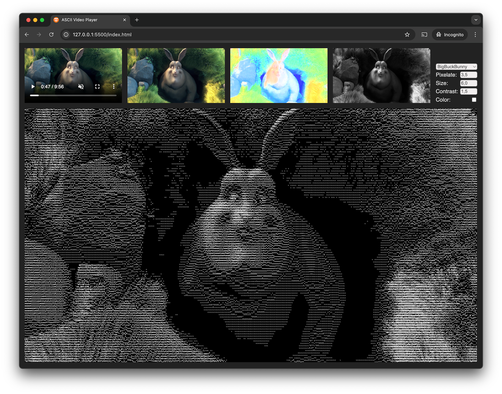

# ASCII Video Player

This is a POC for rendering a video as ASCII art.

- Copies the video frames to a pixelated canvas.
- Splits the RGB pixel values to separate color and brightness values.
- Displays these in additional canvases for demonstration.
- Choses the ASCII character closest to the brightness value of each pixel.
- Puts the color values on a canvas behind the text for the color mode.

## Pages

- The `index` page is the actual player.
- The `scale` page is a code generation tool for creating the ASCII "color scale" for a given font.

## Test videos

The test videos are not included.

- You can put your own videos in the `video` folder,
- Or download some from [here](https://gist.github.com/jsturgis/3b19447b304616f18657), for example [BigBuckBunny.mp4](http://commondatastorage.googleapis.com/gtv-videos-bucket/sample/BigBuckBunny.mp4).
- Or switch to using online videos.

You might need to adjust the `option` elements accordingly in `index.html`.

## Screenshots

